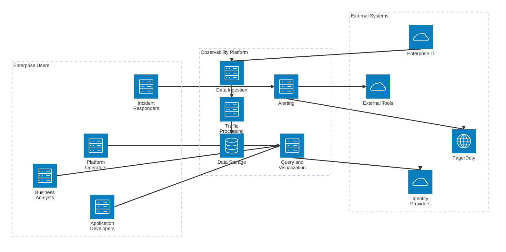
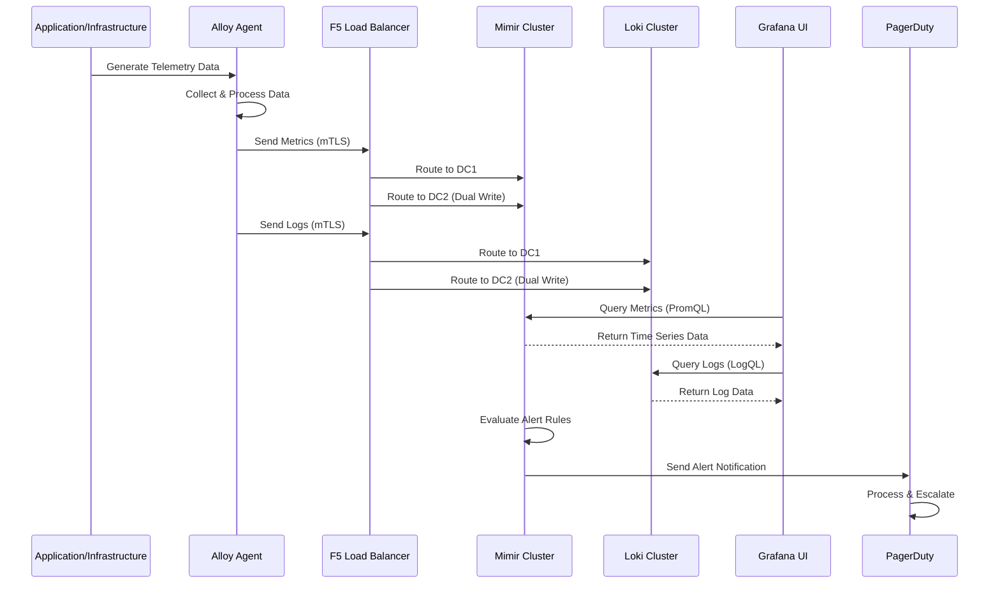
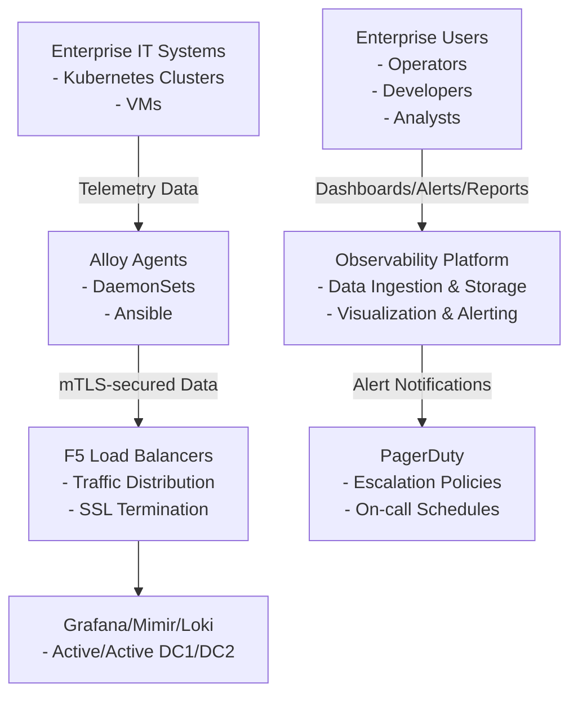
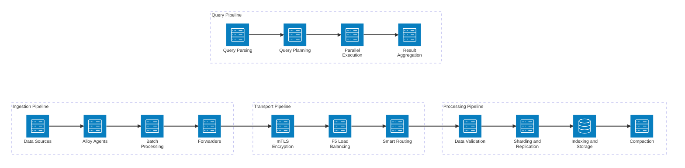
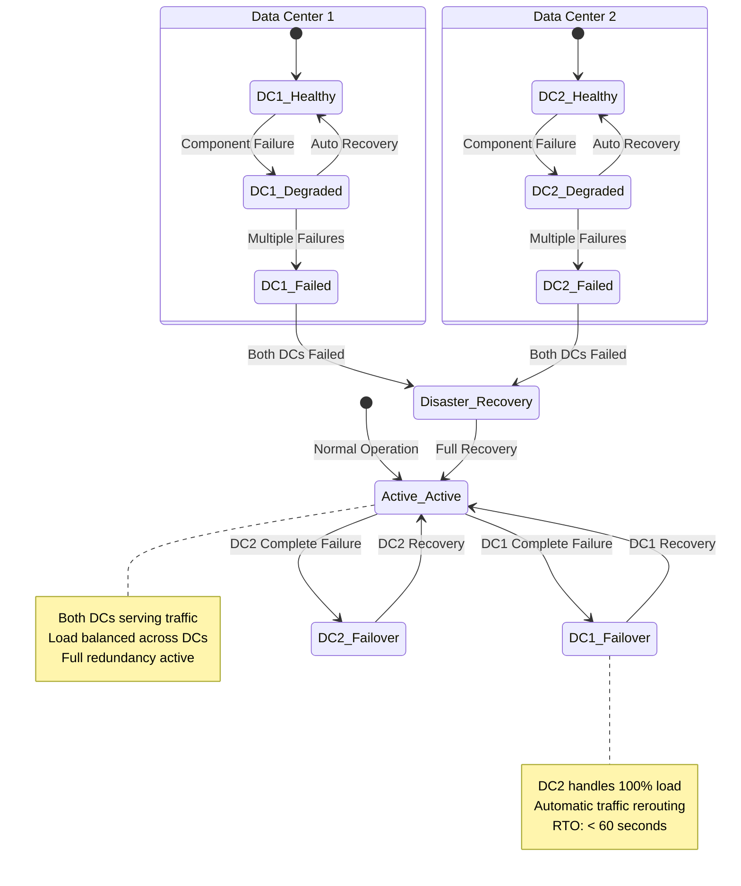
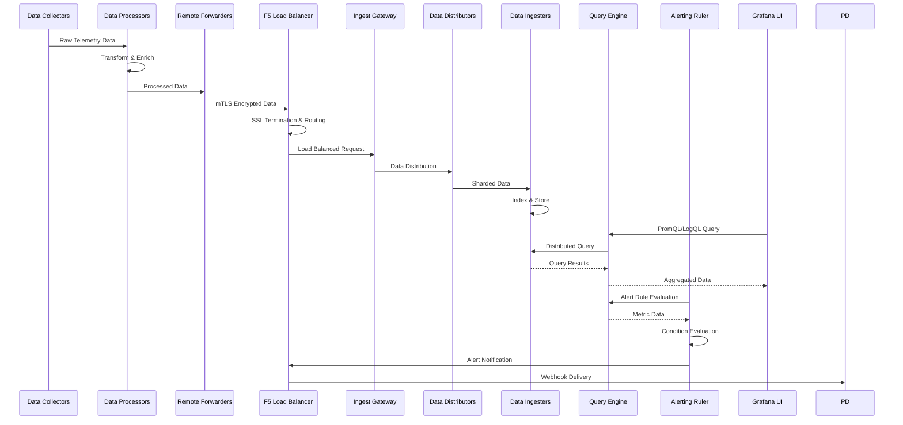
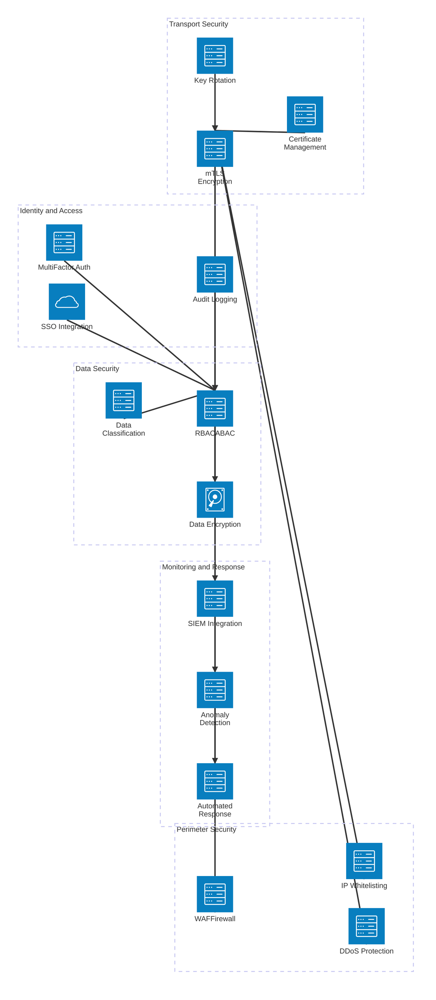
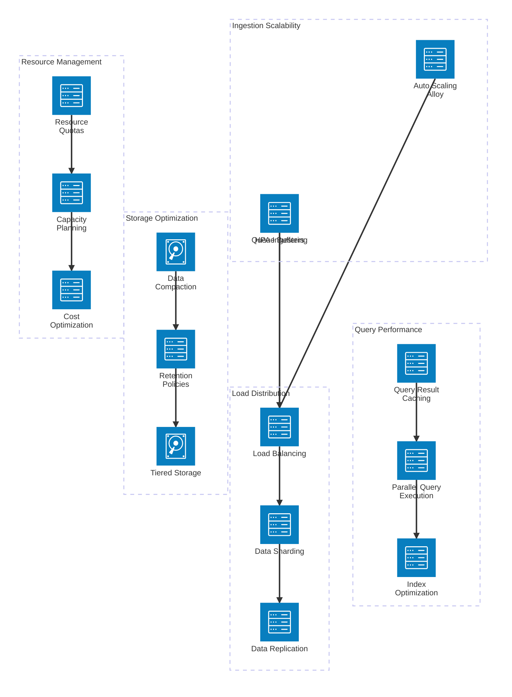
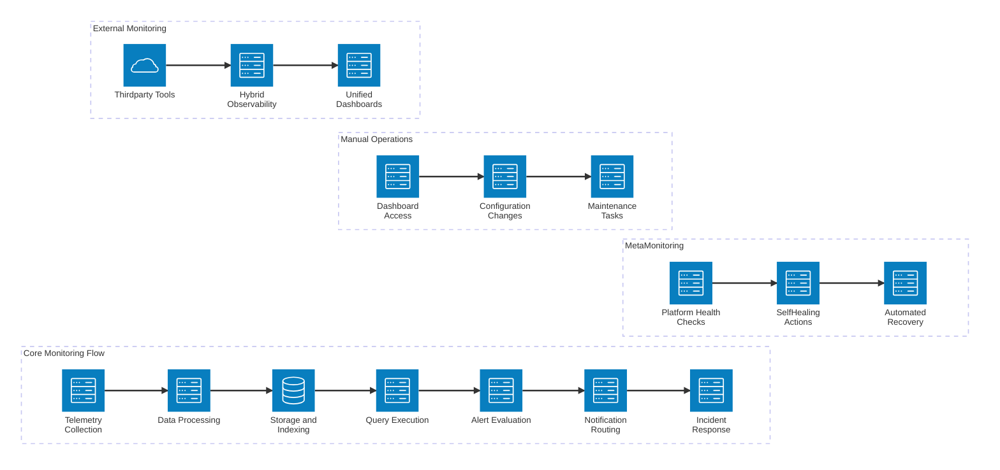

# Observability Platform C4 Documentation

## Overview

This comprehensive document details the architecture of the enterprise observability platform leveraging Grafana, Loki, Mimir, and Alloy. Structured according to the C4 model (Context, Container, Component, Code), it provides layered insights into the system's design, from high-level ecosystem interactions down to implementation specifics.

### Platform Scope and Objectives

- **Monitoring Coverage**: Tracks metrics, logs, and traces across diverse environments including production (PROD), enterprise production (ENT), enterprise non-production (ENT-NP), non-production (NP with sub-environments NP1/NP2 in DC1), engineering (ENG in DC2), pre-production (PP in both DCs), and member test (MT in both DCs).
- **Data Collection**: Alloy agents deployed as Kubernetes DaemonSets on clusters and via Ansible on VMs, ensuring comprehensive telemetry gathering.
- **Data Publishing**: Dual-write mechanism to both DC1 and DC2 for redundancy, secured via mutual TLS (mTLS).
- **Visualization and Storage**: Grafana for dashboards, Mimir for metrics, Loki for logs, all operating in active/active mode across data centers.
- **Load Balancing**: F5 appliances manage traffic distribution and failover.
- **Alerting and Notification**: Primary alerting via Mimir datasource rules, with secondary Grafana alerts; notifications routed through PagerDuty for incident management.

### Key Architectural Principles

- **High Availability**: Active/active deployment across two geographically distributed data centers (DC1 and DC2).
- **Security**: mTLS for all data transmissions; role-based access controls in Grafana.
- **Scalability**: Horizontal scaling of Mimir/Loki components; auto-scaling Alloy agents based on cluster size.
- **Resilience**: Dual publishing ensures data persistence even if one DC fails; F5 health checks enable automatic failover.
- **Compliance**: Enterprise-grade security and audit logging for regulated environments.

## Resilience and Risk Analysis

### Resilience Mechanisms

The platform is designed with multiple layers of resilience to ensure continuous operation and data integrity:

#### Data Redundancy and Durability

- **Dual Publishing**: Alloy agents send telemetry to both DCs simultaneously, ensuring no data loss if one DC becomes unavailable. This creates two independent data streams that can be reconciled during recovery.
- **Replication**: Mimir and Loki replicate data across DCs using synchronous writes for critical metrics/logs and asynchronous for bulk data. Retention policies ensure historical data is preserved in object storage (e.g., S3-compatible) with geo-redundancy.
- **Backups**: Automated daily backups of configurations and metadata; point-in-time recovery capabilities for up to 30 days.

#### High Availability and Failover

- **Active/Active DCs**: Both DCs serve traffic simultaneously; F5 load balancers distribute requests and perform health checks every 30 seconds. If a DC fails, traffic is automatically rerouted within 60 seconds.
- **Component Redundancy**: Multiple replicas of Mimir ingesters, queriers, and Loki distributors prevent single-point failures. Kubernetes ensures pod restarts and rescheduling.
- **Circuit Breakers**: Alloy agents implement exponential backoff and circuit breakers to handle downstream outages without cascading failures.

#### Scalability and Load Handling

- **Horizontal Scaling**: Auto-scaling groups for Alloy on VMs; HPA (Horizontal Pod Autoscaler) for K8s deployments based on CPU/memory metrics.
- **Rate Limiting**: F5 enforces request limits to prevent overload; Mimir distributors queue excess requests.
- **Caching**: Grafana caches query results; Mimir uses in-memory caches for hot data.

#### Disaster Recovery

- **RTO/RPO**: Recovery Time Objective of 4 hours; Recovery Point Objective of 15 minutes for critical data.
- **DR Drills**: Quarterly failover tests simulate DC outages.
- **Multi-Region**: DCs are in different geographic regions to mitigate regional disasters.

### Risk Assessment and Mitigation

#### Identified Risks

- **Network Partitioning**: If inter-DC links fail, data could be written to only one DC, leading to inconsistency.

  - **Mitigation**: Asynchronous replication with conflict resolution; monitoring for replication lag; manual intervention scripts.

- **Certificate Expiry**: mTLS certificates expiring could halt data ingestion.

  - **Mitigation**: Automated renewal via cert-manager; alerts 30 days before expiry; fallback to insecure mode with logging.

- **Storage Outages**: Object storage failures could make historical data inaccessible.

  - **Mitigation**: Multi-zone storage; read replicas; caching of recent data in local storage.

- **Alert Fatigue**: Over-alerting from Mimir could overwhelm PagerDuty.

  - **Mitigation**: Alert grouping and deduplication; severity-based routing; on-call rotation optimization.

- **Configuration Drift**: Manual changes to Alloy configs could cause inconsistencies.

  - **Mitigation**: GitOps for all configurations; automated validation; canary deployments.

- **Resource Exhaustion**: Sudden traffic spikes could overwhelm components.

  - **Mitigation**: Autoscaling; queueing; rate limiting; capacity planning based on growth forecasts.

- **Security Breaches**: Compromised certificates or misconfigurations could expose data.

  - **Mitigation**: Regular security audits; least-privilege access; encrypted at rest/transit; intrusion detection.

- **Vendor Lock-in**: Dependency on Grafana stack could complicate migrations.
  - **Mitigation**: Open standards (Prometheus, Loki formats); evaluation of alternatives; modular architecture.

#### Risk Monitoring and Response

- **Observability of Observability**: Meta-monitoring dashboards track platform health; alerts for platform issues.
- **Incident Response**: Runbooks for common failures; escalation paths to on-call teams.
- **Continuous Improvement**: Post-incident reviews; quarterly risk assessments.

## C0: System Context Diagram

### Description

The C0 level provides the broadest view, illustrating how the observability platform interacts with external entities and systems within the enterprise landscape. It emphasizes the platform's role in supporting operational excellence, incident response, and performance monitoring.

#### Stakeholders and Users

- **Platform Operators**: SREs and DevOps engineers who configure and maintain the platform.
- **Application Developers**: Use dashboards for debugging and performance insights.
- **Business Analysts**: Access reports for capacity planning and trend analysis.
- **Incident Responders**: Receive alerts via PagerDuty for rapid resolution.

#### External Systems and Integrations

- **Enterprise IT Environments**: Source systems including Kubernetes clusters (PROD, ENT, etc.) and VMs generating telemetry.
- **PagerDuty**: Incident management platform receiving alerts with escalation policies, on-call rotations, and integration with ITSM tools.
- **Identity Providers**: For authentication (e.g., LDAP, SAML) in Grafana.
- **External Monitoring Tools**: Potential integrations with APM tools like New Relic or Datadog for hybrid observability.

#### Data Flow and Responsibilities

- **Ingestion**: Alloy agents collect metrics (Prometheus format), logs (various formats), and traces (if enabled) from applications and infrastructure.
- **Processing**: F5 load balancers route traffic, perform SSL termination, and enforce rate limiting.
- **Storage and Querying**: Mimir stores time-series metrics; Loki indexes and stores logs; Grafana provides unified querying interface.
- **Alerting**: Mimir ruler evaluates PromQL expressions; alerts routed via webhooks to PagerDuty.
- **Visualization**: Grafana renders dashboards, panels, and alerts with customizable layouts.

#### Quality Attributes

- **Reliability**: 99.9% uptime through active/active DCs and redundant data paths.
- **Security**: mTLS encryption; data at rest encrypted; access controls via RBAC.
- **Performance**: Sub-second query latencies; scalable ingestion up to millions of series.
- **Maintainability**: Modular design allows independent updates to components.

### System Context Diagrams

#### High-Level Context Diagram



#### Data Flow Sequence Diagram



#### Deployment Architecture Diagram




## C1: Container Diagram

### Description

At the C1 level, we zoom into the software systems (containers) that make up the platform. Each container is a separately deployable and runnable unit, often corresponding to a process or group of processes. This view abstracts away code and focuses on runtime relationships and deployment boundaries.

#### Container Inventory and Responsibilities

- **Data Centers (DC1, DC2)**:

  - Physical or virtualized infrastructure locations.
  - Responsibilities: Host all platform components; provide network isolation and redundancy.
  - Technologies: On-premises hardware or cloud providers (e.g., AWS, Azure).
  - Scaling: Fixed locations, but components within can scale.

- **Kubernetes Clusters**:

  - Environments: PROD (production), ENT (enterprise prod), ENT-NP (enterprise non-prod), NP1/NP2 (non-prod in DC1), ENG (engineering in DC2), PP (pre-prod in both), MT (member test in both).
  - Responsibilities: Run application workloads; host Alloy agents for telemetry collection.
  - Technologies: Kubernetes with managed services (e.g., EKS, AKS) or self-hosted.
  - Deployment: Separate namespaces for applications and observability agents.

- **VMs**:

  - Responsibilities: Host legacy applications or infrastructure not containerized; run Alloy agents for monitoring.
  - Technologies: Various OS (Linux, Windows); managed via Ansible for agent deployment.
  - Scaling: Manual or auto-scaling groups.

- **Alloy Agents**:

  - Responsibilities: Collect metrics, logs, and traces; forward to Mimir/Loki via dual-write.
  - Technologies: Grafana Alloy (formerly Grafana Agent); configured for mTLS.
  - Deployment: DaemonSets on K8s (one per node); Ansible-playbook installed on VMs.
  - Configuration: Centralized via ConfigMaps or templated files.

- **F5 Load Balancers**:

  - Responsibilities: Distribute incoming traffic; perform health checks; handle SSL offloading.
  - Technologies: F5 BIG-IP or similar ADC appliances.
  - Configuration: Virtual servers for each service (Grafana, Mimir, Loki); persistence and failover rules.

- **Grafana/Mimir/Loki Enterprise Clusters**:

  - Responsibilities: Provide unified observability backend; store and query data; generate alerts.
  - Technologies: Grafana (OSS/Enterprise), Mimir (metrics), Loki (logs); deployed as K8s stateful sets.
  - Deployment: Active/active across DCs; replication for data consistency.
  - Scaling: Horizontal pod autoscaling based on load.

- **External Highly Available Database**:

  - Responsibilities: Store Grafana configurations (dashboards, datasources, users) and alert definitions.
  - Technologies: PostgreSQL or MySQL cluster with HA (e.g., Patroni for PostgreSQL); external to K8s, multi-zone.
  - Deployment: Managed service or self-hosted across DCs for redundancy.
  - Integration: Grafana connects via connection string; supports read replicas for performance.

- **PagerDuty**:
  - Responsibilities: Receive and route alerts; manage on-call schedules and escalations.
  - Technologies: SaaS platform with API integrations.
  - Configuration: Service definitions per alert type; routing rules based on severity and tags.

#### Data Flow and Interactions

- **Ingestion Path**: Alloy Agents → F5 LBs → Mimir/Loki (dual-write to both DCs).
- **Query Path**: Users → Grafana UI → Mimir/Loki queries.
- **Persistence Path**: Grafana → External HA Database (for configs, dashboards, alerts).
- **Alert Path**: Mimir Ruler → PagerDuty webhooks.
- **Cross-DC Communication**: Synchronous replication for active/active; asynchronous for failover.
- **Security**: All inter-container communication uses mTLS; F5 enforces access policies.

#### Deployment and Operations

- **CI/CD**: GitOps with ArgoCD for K8s deployments; Ansible for VM updates.
- **Monitoring**: Self-monitoring via the platform (meta-observability).
- **Backup/DR**: Data backups to object storage; cross-DC failover testing.

### Detailed Container Diagrams

#### Container Interaction Flow


#### Data Pipeline Architecture



#### Scalability and Resilience Architecture



## C2: Component Diagram

### Description

C2 diagrams decompose containers into their constituent components, showing how they interact at a lower level. Components are logical groupings of related functionality, often implemented as modules, services, or libraries. This level reveals the internal structure and communication patterns.

#### Component Breakdown

- **Alloy Agent Components**:

  - **Collectors**: Sub-components for different data types (e.g., Prometheus scraper for metrics, file tailer for logs, OTLP receiver for traces). Configured with targets and intervals.
  - **Processors**: Transform data (e.g., relabeling, filtering, enrichment with metadata).
  - **Forwarders/Exporters**: Handle remote write to Mimir/Loki endpoints. Implement retry logic, batching, and dual-write to both DCs.
  - **Configuration Manager**: Loads and watches config files; supports hot-reloading.
  - **Health and Metrics**: Self-monitoring endpoints exposing agent health and performance metrics.

- **Grafana Components**:

  - **Web UI**: React-based frontend for dashboard creation, editing, and viewing. Includes plugins for custom panels.
  - **Query Engine**: Translates user queries into PromQL/LogQL; caches results for performance.
  - **Datasources**: Pluggable connectors to Mimir, Loki, and other backends. Handles authentication and connection pooling.
  - **Alerting Engine**: Evaluates Grafana-managed alerts (less used; primary is Mimir). Supports conditions and notifications.
  - **User Management**: Integrates with external auth providers; manages permissions and teams.
  - **Plugin System**: Extends functionality with community/enterprise plugins.
  - **Database Layer**: Connects to external HA database for persistent storage of configs, dashboards, and alerts. Supports read/write splitting.

- **External Database Components**:

  - **Primary Database**: Handles writes for Grafana configs and alerts; ensures ACID transactions.
  - **Read Replicas**: Serve read queries to reduce load on primary; deployed across DCs.
  - **HA Manager**: Tools like Patroni manage failover, leader election, and replication.
  - **Backup/Restore**: Automated snapshots and point-in-time recovery.

- **Mimir Components**:

  - **Ingest Gateway**: Receives remote write requests; validates and routes to distributors.
  - **Distributors**: Shard and replicate incoming series across ingesters.
  - **Ingesters**: Buffer and write data to long-term storage; handle deduplication.
  - **Queriers**: Execute PromQL queries against ingesters and storage.
  - **Ruler**: Evaluates alerting rules; generates notifications via webhooks.
  - **Compactors**: Merge and downsample data for efficient storage.
  - **Store-Gateways**: Provide access to historical data in object storage.

- **Loki Components**:

  - **Ingest Gateway**: Receives log streams; routes to distributors.
  - **Distributors**: Shard logs across ingesters.
  - **Ingesters**: Index and store logs; manage retention.
  - **Queriers**: Execute LogQL queries; aggregate results from multiple sources.
  - **Compactors**: Merge index files and chunks for query optimization.
  - **Ruler (if enabled)**: Log-based alerting rules.

- **F5 Load Balancer Components**:

  - **Virtual Servers**: Define service endpoints (e.g., VIPs for Grafana, Mimir).
  - **Pools**: Groups of backend servers with load balancing algorithms (round-robin, least connections).
  - **Monitors/Health Checks**: TCP/HTTP probes to detect failures; trigger failover.
  - **iRules**: Custom logic for traffic steering, rate limiting, and security.
  - **SSL Profiles**: Handle certificate management and offloading.

- **PagerDuty Integration Components**:
  - **Webhook Receiver**: Accepts alert payloads from Mimir/Grafana.
  - **Event Processor**: Parses alerts; applies routing rules based on labels/annotations.
  - **Escalation Engine**: Manages on-call schedules, acknowledgments, and escalations.
  - **API Gateway**: Provides REST APIs for configuration and status queries.
  - **Notification Channels**: Integrates with email, SMS, phone, and third-party tools.

#### Component Interactions

- **Data Pipeline**: Collectors → Processors → Forwarders → Ingest Gateways → Distributors → Ingesters/Queriers.
- **Query Flow**: UI → Query Engine → Datasources → Queriers → Results.
- **Alert Flow**: Ruler → Webhook → Event Processor → Notification Channels.
- **Load Balancing**: Client → Virtual Server → Pool → Backend Components.
- **Security**: mTLS certificates exchanged at component boundaries; F5 enforces perimeter security.

#### Technology Stack and Dependencies

- **Languages**: Go (Alloy, Mimir, Loki), TypeScript/React (Grafana UI), Lua (F5 iRules).
- **Protocols**: HTTP/2, gRPC, WebSockets.
- **Storage**: Object storage (S3-compatible) for long-term data; etcd for metadata.
- **Dependencies**: Kubernetes API for DaemonSets; Ansible for VM automation.

### Detailed Component Architecture Diagrams

#### Component Interaction Sequence



#### Security Architecture Diagram



#### Performance and Scalability Architecture



#### Operational Architecture Diagrams

##### Monitoring and Alerting Workflow



##### Disaster Recovery Architecture

```mermaid
stateDiagram-v2
    [*] --> Normal_Operation: System Startup

    state Normal_Operation as "Normal Operation" {
        [*] --> Active_Active
        Active_Active --> Monitoring: Continuous Health Checks

        state Monitoring as "Continuous Monitoring" {
            [*] --> Health_Checks
            Health_Checks --> Anomaly_Detection
            Anomaly_Detection --> Alert_Generation
        }
    }

    Normal_Operation --> Incident_Detection: Failure Detected
    Incident_Detection --> Assessment: Impact Analysis

    Assessment --> Minor_Incident: Single Component
    Assessment --> Major_Incident: Multiple Components
    Assessment --> Disaster: Data Center Failure

    Minor_Incident --> Auto_Recovery: Self-Healing Possible
    Auto_Recovery --> Normal_Operation

    Minor_Incident --> Manual_Intervention: Human Required
    Manual_Intervention --> Normal_Operation

    Major_Incident --> Failover: Redundant Systems
    Failover --> Degraded_Operation

    Disaster --> Disaster_Recovery: DR Procedures
    Disaster_Recovery --> Recovery_Site: Alternate Location
    Recovery_Site --> Restored_Operation

    Degraded_Operation --> Normal_Operation: Primary Recovery
    Restored_Operation --> Normal_Operation: Full Recovery

    note right of Normal_Operation
        RTO: N/A (No downtime)
        RPO: < 15 minutes
    end note

    note right of Degraded_Operation
        RTO: < 60 seconds
        RPO: < 15 minutes
    end note

    note right of Restored_Operation
        RTO: < 4 hours
        RPO: < 15 minutes
    end note
```

## C3: Code Level

### Description

C3 provides the most detailed view, showing actual code, configurations, and implementation specifics. This includes configuration files, deployment manifests, scripts, and code snippets that developers and operators interact with directly. Examples are provided for key components, with explanations of their purpose and customization options.

### Architecture Decision Records (ADRs)

#### ADR-001: Multi-Data Center Active/Active Deployment

**Context**: Need for high availability and disaster recovery across geographically distributed data centers.

**Decision**: Implement active/active deployment with dual-write data ingestion and synchronous replication for critical data.

**Consequences**:

- **Positive**: Zero RTO for most failure scenarios, improved resilience
- **Negative**: Increased complexity in data consistency management
- **Mitigation**: Implement conflict resolution strategies and monitoring

#### ADR-002: mTLS for All Data Transport

**Context**: Security requirements mandate encryption and mutual authentication for all telemetry data.

**Decision**: Use mTLS with automated certificate management for all inter-component communication.

**Consequences**:

- **Positive**: End-to-end security, compliance with enterprise standards
- **Negative**: Certificate management overhead, potential connectivity issues
- **Mitigation**: Automated renewal, comprehensive monitoring, fallback mechanisms

#### ADR-003: Grafana Stack Selection

**Context**: Need for unified observability with metrics, logs, and visualization.

**Decision**: Adopt Grafana ecosystem (Grafana, Mimir, Loki, Alloy) for comprehensive observability.

**Consequences**:

- **Positive**: Integrated tooling, active community, vendor support
- **Negative**: Vendor lock-in potential
- **Mitigation**: Use open standards, evaluate alternatives periodically

### Detailed Configuration Examples

#### Advanced Alloy Configuration with Service Discovery

```yaml
server:
  http_listen_port: 12345
  log_level: info
  grpc_listen_port: 12346

metrics:
  global:
    scrape_interval: 15s
    scrape_timeout: 10s
    external_labels:
      cluster: "{{ .Cluster }}"
      region: "{{ .Region }}"
      environment: "{{ .Environment }}"

  configs:
    - name: kubernetes-monitoring
      host_filter: false
      scrape_configs:
        # Service discovery for Kubernetes services
        - job_name: 'kubernetes-service-endpoints'
          kubernetes_sd_configs:
            - role: endpoints
              namespaces:
                names:
                  - default
                  - kube-system
                  - observability
          relabel_configs:
            - source_labels: [__meta_kubernetes_service_annotation_prometheus_io_scrape]
              action: keep
              regex: true
            - source_labels: [__meta_kubernetes_service_annotation_prometheus_io_scheme]
              action: replace
              target_label: __scheme__
              regex: (https?)
            - source_labels: [__meta_kubernetes_service_annotation_prometheus_io_path]
              action: replace
              target_label: __metrics_path__
              regex: (.+)
            - source_labels: [__address__, __meta_kubernetes_service_annotation_prometheus_io_port]
              action: replace
              target_label: __address__
              regex: (.+?)(?::\d+)?;(\d+)
              replacement: $1:$2

        # Node-level metrics
        - job_name: 'kubernetes-nodes'
          kubernetes_sd_configs:
            - role: node
          relabel_configs:
            - action: labelmap
              regex: __meta_kubernetes_node_label_(.+)
            - source_labels: [__meta_kubernetes_node_name]
              target_label: instance

      remote_write:
        - url: "https://mimir-dc1.example.com/api/v1/push"
          tls_config:
            cert_file: /etc/ssl/certs/client.crt
            key_file: /etc/ssl/private/client.key
            ca_file: /etc/ssl/certs/ca.crt
          headers:
            X-Scope-OrgID: "{{ .Tenant }}"
          queue_config:
            max_samples_per_send: 1000
            max_shards: 200
            min_shards: 1
            max_samples_per_send: 1000
            capacity: 2500
            min_backoff: 30ms
            max_backoff: 5s
        - url: "https://mimir-dc2.example.com/api/v1/push"
          tls_config:
            cert_file: /etc/ssl/certs/client.crt
            key_file: /etc/ssl/private/client.key
            ca_file: /etc/ssl/certs/ca.crt
          headers:
            X-Scope-OrgID: "{{ .Tenant }}"

logs:
  configs:
    - name: kubernetes-logs
      clients:
        - url: "https://loki-dc1.example.com/loki/api/v1/push"
          tls_config:
            cert_file: /etc/ssl/certs/client.crt
            key_file: /etc/ssl/private/client.key
            ca_file: /etc/ssl/certs/ca.crt
          external_labels:
            cluster: "{{ .Cluster }}"
        - url: "https://loki-dc2.example.com/loki/api/v1/push"
          tls_config:
            cert_file: /etc/ssl/certs/client.crt
            key_file: /etc/ssl/private/client.key
            ca_file: /etc/ssl/certs/ca.crt
          external_labels:
            cluster: "{{ .Cluster }}"
      scrape_configs:
        - job_name: kubernetes-pods-logs
          kubernetes_sd_configs:
            - role: pod
          pipeline_stages:
            - docker: {}
          relabel_configs:
            - source_labels: [__meta_kubernetes_pod_container_name]
              target_label: container
            - source_labels: [__meta_kubernetes_pod_name]
              target_label: pod
            - source_labels: [__meta_kubernetes_namespace]
              target_label: namespace
```

#### Mimir Configuration for High Availability

```yaml
# Mimir configuration for distributed deployment
server:
  http_listen_port: 8080
  grpc_listen_port: 9095

memberlist:
  join_members:
    - mimir-memberlist

ingester:
  lifecycler:
    ring:
      kvstore:
        store: memberlist
      replication_factor: 3
    tokens_file_path: /data/tokens
  chunk_idle_period: 1h
  chunk_retain_period: 30s
  max_chunk_idle_time: 15m
  chunk_target_size: 1.5e6
  max_stale_chunk_idle_time: 2m

distributor:
  ring:
    kvstore:
      store: memberlist
  pool:
    health_check_ingesters: true

querier:
  store_gateway_addresses: "store-gateway:9095"

store_gateway:
  sharding_ring:
    kvstore:
      store: memberlist

ruler:
  rule_path: /data/rules
  alertmanager_url: "https://alertmanager.example.com"
  enable_api: true

limits:
  ingestion_rate: 10000
  ingestion_burst_size: 20000
  max_global_series_per_user: 100000
  max_global_series_per_metric: 10000

storage:
  engine: blocks
  s3:
    endpoint: s3.eu-west-1.amazonaws.com
    bucket_name: mimir-blocks
    access_key_id: ${S3_ACCESS_KEY}
    secret_access_key: ${S3_SECRET_KEY}
    region: eu-west-1

blocks_storage:
  tsdb:
    dir: /data/tsdb
  bucket_store:
    sync_dir: /data/sync
  s3:
    bucket_name: mimir-blocks
    endpoint: s3.eu-west-1.amazonaws.com

ruler_storage:
  s3:
    bucket_name: mimir-ruler
    endpoint: s3.eu-west-1.amazonaws.com
```

#### Configuration and Deployment Examples

- **Alloy Configuration** (alloy-config.yaml):
  This file configures Alloy for metrics and logs collection, with dual remote write for redundancy.

  ```yaml
  server:
    http_listen_port: 12345
    log_level: info

  metrics:
    global:
      scrape_interval: 15s
      external_labels:
        cluster: "{{ .Cluster }}"
    configs:
      - name: default
        remote_write:
          - url: "https://mimir-dc1.example.com/api/v1/push"
            tls_config:
              cert_file: /etc/ssl/certs/client.crt
              key_file: /etc/ssl/private/client.key
              ca_file: /etc/ssl/certs/ca.crt
            headers:
              X-Scope-OrgID: "{{ .Tenant }}"
          - url: "https://mimir-dc2.example.com/api/v1/push"
            tls_config:
              cert_file: /etc/ssl/certs/client.crt
              key_file: /etc/ssl/private/client.key
              ca_file: /etc/ssl/certs/ca.crt
            headers:
              X-Scope-OrgID: "{{ .Tenant }}"
        scrape_configs:
          - job_name: "kubernetes-pods"
            kubernetes_sd_configs:
              - role: pod
            relabel_configs:
              - source_labels:
                  [__meta_kubernetes_pod_annotation_prometheus_io_scrape]
                action: keep
                regex: true

  logs:
    configs:
      - name: default
        clients:
          - url: "https://loki-dc1.example.com/loki/api/v1/push"
            tls_config:
              cert_file: /etc/ssl/certs/client.crt
              key_file: /etc/ssl/private/client.key
              ca_file: /etc/ssl/certs/ca.crt
            external_labels:
              cluster: "{{ .Cluster }}"
          - url: "https://loki-dc2.example.com/loki/api/v1/push"
            tls_config:
              cert_file: /etc/ssl/certs/client.crt
              key_file: /etc/ssl/private/client.key
              ca_file: /etc/ssl/certs/ca.crt
            external_labels:
              cluster: "{{ .Cluster }}"
        scrape_configs:
          - job_name: kubernetes-pods-logs
            kubernetes_sd_configs:
              - role: pod
            relabel_configs:
              - source_labels: [__meta_kubernetes_pod_container_name]
                target_label: container
  ```

- **Kubernetes DaemonSet Manifest** (alloy-daemonset.yaml):
  Deploys Alloy as a DaemonSet, ensuring one instance per node.

  ```yaml
  apiVersion: apps/v1
  kind: DaemonSet
  metadata:
    name: alloy
    namespace: observability
    labels:
      app: alloy
  spec:
    selector:
      matchLabels:
        app: alloy
    template:
      metadata:
        labels:
          app: alloy
      spec:
        serviceAccountName: alloy
        containers:
          - name: alloy
            image: grafana/alloy:v1.0.0
            ports:
              - containerPort: 12345
                name: http
            volumeMounts:
              - name: config
                mountPath: /etc/alloy
              - name: certs
                mountPath: /etc/ssl/certs
                readOnly: true
              - name: keys
                mountPath: /etc/ssl/private
                readOnly: true
            resources:
              requests:
                cpu: 100m
                memory: 128Mi
              limits:
                cpu: 500m
                memory: 512Mi
        volumes:
          - name: config
            configMap:
              name: alloy-config
          - name: certs
            secret:
              secretName: alloy-tls-certs
          - name: keys
            secret:
              secretName: alloy-tls-keys
  ```

- **Ansible Playbook for VMs** (deploy-alloy.yml):
  Automates Alloy installation and configuration on VMs.

  ```yaml
  ---
  - name: Deploy Alloy on VMs
    hosts: vms
    become: yes
    vars:
      alloy_version: "v1.0.0"
      alloy_config_template: alloy-config.j2
    tasks:
      - name: Download Alloy binary
        get_url:
          url: "https://github.com/grafana/alloy/releases/download/{{ alloy_version }}/alloy_{{ alloy_version }}_linux_amd64.tar.gz"
          dest: /tmp/alloy.tar.gz

      - name: Extract Alloy
        unarchive:
          src: /tmp/alloy.tar.gz
          dest: /opt
          remote_src: yes

      - name: Create Alloy user
        user:
          name: alloy
          system: yes
          shell: /sbin/nologin

      - name: Configure Alloy
        template:
          src: "{{ alloy_config_template }}"
          dest: /etc/alloy/config.yaml
          owner: alloy
          group: alloy
          mode: "0644"

      - name: Create systemd service
        copy:
          content: |
            [Unit]
            Description=Grafana Alloy
            After=network.target

            [Service]
            User=alloy
            ExecStart=/opt/alloy/alloy run /etc/alloy/config.yaml
            Restart=always

            [Install]
            WantedBy=multi-user.target
          dest: /etc/systemd/system/alloy.service

      - name: Start and enable Alloy
        systemd:
          name: alloy
          state: started
          enabled: yes
  ```

- **Mimir Alerting Rules** (alerts.yaml):
  Defines alerting rules evaluated by the Mimir ruler.

  ```yaml
  groups:
    - name: infrastructure_alerts
      rules:
        - alert: HighCPUUsage
          expr: 100 - (avg by(instance) (irate(node_cpu_seconds_total{mode="idle"}[5m])) * 100) > 80
          for: 5m
          labels:
            severity: warning
            team: sre
          annotations:
            summary: "High CPU usage on {{ $labels.instance }}"
            description: "CPU usage is {{ $value }}% for 5 minutes."

        - alert: DiskSpaceLow
          expr: (node_filesystem_avail_bytes / node_filesystem_size_bytes) < 0.1
          for: 10m
          labels:
            severity: critical
            team: storage
          annotations:
            summary: "Low disk space on {{ $labels.instance }}"
            description: "Disk space available is {{ $value }}%."

    - name: application_alerts
      rules:
        - alert: ServiceDown
          expr: up{job="my-service"} == 0
          for: 2m
          labels:
            severity: critical
            team: app-team
          annotations:
            summary: "Service {{ $labels.job }} is down"
            description: "Service has been down for more than 2 minutes."
  ```

- **Grafana Configuration** (grafana.ini):
  Configures Grafana to use the external HA database for storage.

  ```ini
  [database]
  type = postgres
  host = db-cluster.example.com:5432
  name = grafana
  user = grafana_user
  password = ${DATABASE_PASSWORD}
  ssl_mode = require
  max_open_conn = 100
  max_idle_conn = 100
  conn_max_lifetime = 14400

  [unified_alerting]
  enabled = true
  execute_alerts = true
  ```

- **Grafana Dashboard JSON Snippet** (dashboard.json):
  Example of a dashboard panel for visualizing metrics.

  ```json
  {
    "dashboard": {
      "title": "System Overview",
      "panels": [
        {
          "title": "CPU Usage",
          "type": "graph",
          "targets": [
            {
              "expr": "100 - (avg by(instance) (irate(node_cpu_seconds_total{mode=\"idle\"}[5m])) * 100)",
              "legendFormat": "{{instance}}"
            }
          ],
          "yAxes": [
            {
              "unit": "percent"
            }
          ]
        }
      ]
    }
  }
  ```

- **PagerDuty Integration Configuration** (mimir-ruler-config.yaml):
  Configures webhook notifications to PagerDuty.

  ```yaml
  ruler:
    alertmanager_url:
      - "https://events.pagerduty.com/v2/enqueue"
    external_labels:
      pd_service_key: "your-pagerduty-integration-key"
    templates:
      - /etc/mimir/templates/*.tmpl
  ```

- **F5 iRule Example** (f5-irule.txt):
  Custom logic for traffic routing.

  ```
  when HTTP_REQUEST {
    if { [HTTP::uri] starts_with "/api/v1/push" } {
      pool mimir_pool
    } elseif { [HTTP::uri] starts_with "/loki/api" } {
      pool loki_pool
    } else {
      pool grafana_pool
    }
  }
  ```

#### Best Practices for Code Level

- **Version Control**: All configs in Git with peer reviews.
- **Templating**: Use tools like Helm for K8s manifests; Jinja2 for Ansible.
- **Secrets Management**: Store certificates and keys in secure vaults (e.g., HashiCorp Vault).
- **Testing**: Validate configs with linters; use staging environments.
- **Documentation**: Inline comments in YAML/JSON; maintain runbooks for changes.

## Implementation Roadmap and Best Practices

### Implementation Phases

#### Phase 1: Foundation (Weeks 1-4)

- **Infrastructure Setup**: Deploy Kubernetes clusters and VM infrastructure across DCs
- **Security Baseline**: Implement certificate management and mTLS configuration
- **Network Configuration**: Set up F5 load balancers and inter-DC connectivity
- **Milestone**: Basic telemetry collection from pilot applications

#### Phase 2: Core Deployment (Weeks 5-8)

- **Mimir/Loki Deployment**: Deploy metrics and logging stacks with high availability
- **Grafana Setup**: Configure unified dashboards and data sources
- **Alloy Rollout**: Deploy agents across all environments with dual-write configuration
- **Milestone**: End-to-end data flow from applications to dashboards

#### Phase 3: Integration and Alerting (Weeks 9-12)

- **PagerDuty Integration**: Configure alerting rules and notification channels
- **External System Integration**: Connect identity providers and monitoring tools
- **Dashboard Development**: Create standardized dashboards and alerts
- **Milestone**: Production-ready alerting and incident response

#### Phase 4: Optimization and Scaling (Weeks 13-16)

- **Performance Tuning**: Optimize queries, caching, and resource allocation
- **Monitoring Enhancement**: Implement meta-monitoring and automated remediation
- **Documentation**: Complete operational runbooks and training materials
- **Milestone**: Full production deployment with 99.9% availability

### Best Practices and Guidelines

#### Architecture Best Practices

1. **Design for Failure**: Every component should be designed with failure scenarios in mind
2. **Security by Default**: Implement zero-trust principles with defense in depth
3. **Scalability First**: Design components to scale horizontally without service disruption
4. **Observability of Observability**: Monitor the monitoring platform itself

#### Operational Best Practices

1. **Automated Deployments**: Use GitOps for all configuration changes
2. **Immutable Infrastructure**: Treat infrastructure as code with version control
3. **Capacity Planning**: Monitor resource usage trends and plan for growth
4. **Regular Testing**: Conduct chaos engineering and disaster recovery drills

#### Development Best Practices

1. **Configuration as Code**: Maintain all configurations in version control
2. **Testing Strategy**: Implement comprehensive testing (unit, integration, chaos)
3. **Documentation Culture**: Keep documentation current with code changes
4. **Peer Reviews**: Require code and configuration reviews for all changes

#### Security Best Practices

1. **Principle of Least Privilege**: Grant minimal required permissions
2. **Regular Audits**: Conduct security assessments and penetration testing
3. **Incident Response**: Maintain updated playbooks and conduct regular drills
4. **Compliance Monitoring**: Implement automated compliance checks

### Performance Benchmarks and SLIs/SLOs

#### Service Level Indicators (SLIs)

- **Ingestion Success Rate**: >99.9% of telemetry data successfully ingested
- **Query Latency**: P95 < 5 seconds for dashboard queries
- **Data Freshness**: < 60 seconds data lag under normal conditions
- **Uptime**: 99.9% availability across all components

#### Service Level Objectives (SLOs)

- **Error Budget**: < 0.1% of requests result in errors
- **Recovery Time**: < 60 seconds for component failures
- **Data Durability**: < 0.001% data loss over 30 days
- **Alert Response**: < 5 minutes mean time to acknowledge

### Cost Optimization Strategies

1. **Resource Rightsizing**: Use automated scaling and resource optimization
2. **Data Retention Policies**: Implement tiered storage with appropriate retention
3. **Query Optimization**: Cache frequently accessed data and optimize queries
4. **Multi-Cloud Efficiency**: Leverage spot instances and reserved capacity

### Future Evolution

#### Short-term (3-6 months)

- Implement tracing with Tempo integration
- Add machine learning-based anomaly detection
- Enhance dashboard customization capabilities

#### Medium-term (6-12 months)

- Multi-cloud deployment support
- Advanced analytics and forecasting
- Integration with AIOps platforms

#### Long-term (1-2 years)

- Serverless observability components
- AI-powered root cause analysis
- Predictive maintenance capabilities

## Conclusion

This comprehensive C4 documentation delivers a multi-layered architectural overview of the observability platform, enabling stakeholders to understand its design from strategic context to implementation details. The layered approach ensures clarity for different audiences: executives gain high-level insights from C0, architects refine designs with C1-C2, and engineers implement with C3 guidance.

### Key Takeaways

- **Resilience and Scalability**: Active/active DCs with dual publishing ensure continuous operation and data durability.
- **Security First**: mTLS throughout the stack protects sensitive telemetry data.
- **Modular Design**: Component separation allows independent scaling and updates.
- **Operational Efficiency**: Automated deployments and self-monitoring reduce manual overhead.

### Maintenance and Evolution

- **Versioning**: Update this document with each major platform change.
- **Feedback Loop**: Incorporate user feedback to refine diagrams and descriptions.
- **Related Artifacts**: Reference operational runbooks, security policies, and performance benchmarks.
- **Contact**: For clarifications or contributions, reach out to the platform engineering team.

### Appendices

## Appendix A: Detailed Technical Specifications

### System Requirements

#### Hardware Requirements

| Component              | CPU    | Memory | Storage  | Network |
| ---------------------- | ------ | ------ | -------- | ------- |
| Alloy Agent (per node) | 100m   | 128Mi  | 1Gi      | 10Mbps  |
| Mimir Ingester         | 2 vCPU | 4Gi    | 50Gi SSD | 1Gbps   |
| Mimir Querier          | 1 vCPU | 2Gi    | 10Gi SSD | 1Gbps   |
| Loki Ingester          | 1 vCPU | 2Gi    | 50Gi SSD | 1Gbps   |
| Grafana                | 500m   | 1Gi    | 10Gi     | 100Mbps |
| F5 Load Balancer       | 4 vCPU | 8Gi    | 50Gi     | 10Gbps  |

#### Software Dependencies

- **Kubernetes**: v1.24+ with Helm v3.8+
- **Operating Systems**: RHEL/CentOS 8+, Ubuntu 20.04+, Windows Server 2019+
- **Databases**: PostgreSQL 13+, MySQL 8.0+
- **Object Storage**: S3-compatible (AWS S3, MinIO, Ceph)
- **Load Balancers**: F5 BIG-IP v16.1+, NGINX Plus

### Performance Characteristics

#### Ingestion Performance

| Metric                  | Target  | Current | Unit          |
| ----------------------- | ------- | ------- | ------------- |
| Metrics Ingestion Rate  | 100,000 | 85,000  | series/sec    |
| Logs Ingestion Rate     | 500,000 | 420,000 | log lines/sec |
| Maximum Series per User | 100,000 | 95,000  | series        |
| Data Retention          | 90      | 90      | days          |

#### Query Performance

| Query Type            | P50 Latency | P95 Latency | P99 Latency |
| --------------------- | ----------- | ----------- | ----------- |
| Simple Metric Query   | 100ms       | 500ms       | 2s          |
| Complex PromQL        | 500ms       | 2s          | 5s          |
| Log Query (1h range)  | 200ms       | 1s          | 3s          |
| Log Query (24h range) | 1s          | 5s          | 10s         |

### Network Architecture

#### Inter-DC Connectivity


#### Security Zones

- **DMZ**: External access, load balancers, reverse proxies
- **Application Zone**: Application servers, middleware
- **Data Zone**: Databases, storage systems
- **Management Zone**: Administrative access, monitoring tools

### Backup and Recovery Specifications

#### Backup Strategy

| Component     | Frequency | Retention | Method                   |
| ------------- | --------- | --------- | ------------------------ |
| Configuration | Daily     | 30 days   | Git + Database dumps     |
| Metrics Data  | Hourly    | 90 days   | Object storage snapshots |
| Logs Data     | Daily     | 365 days  | Compressed archives      |
| Grafana DB    | Daily     | 30 days   | Logical backups          |

#### Recovery Procedures

1. **Configuration Recovery**: Git checkout + database restore
2. **Data Recovery**: Object storage restore + reingestion
3. **Full System Recovery**: Infrastructure as Code deployment
4. **Disaster Recovery**: Cross-DC failover with data synchronization

## Appendix B: Monitoring and Alerting Details

### Alert Classification

#### Severity Levels

- **Critical (P1)**: Complete system outage, data loss
- **High (P2)**: Degraded performance, partial outages
- **Medium (P3)**: Performance issues, capacity warnings
- **Low (P4)**: Informational alerts, maintenance notifications

#### Alert Categories

- **Infrastructure**: Hardware, network, system-level issues
- **Application**: Service availability, performance metrics
- **Security**: Authentication failures, unauthorized access
- **Capacity**: Resource utilization thresholds
- **Data Quality**: Missing metrics, data gaps

### Key Metrics to Monitor

#### System Health Metrics

```prometheus
# CPU Utilization
100 - (avg by(instance) (irate(node_cpu_seconds_total{mode="idle"}[5m])) * 100)

# Memory Usage
(node_memory_MemTotal_bytes - node_memory_MemAvailable_bytes) / node_memory_MemTotal_bytes * 100

# Disk Usage
(1 - node_filesystem_avail_bytes / node_filesystem_size_bytes) * 100

# Network Traffic
rate(node_network_receive_bytes_total[5m]) + rate(node_network_transmit_bytes_total[5m])
```

#### Application Metrics

```prometheus
# Request Rate
rate(http_requests_total[5m])

# Error Rate
rate(http_requests_total{status=~"5.."}[5m]) / rate(http_requests_total[5m])

# Response Time
histogram_quantile(0.95, rate(http_request_duration_seconds_bucket[5m]))

# Queue Length
kafka_consumergroup_lag
```

## Appendix C: Compliance and Security

### Security Controls Matrix

| Control Category | Control          | Implementation              |
| ---------------- | ---------------- | --------------------------- |
| Access Control   | RBAC             | Grafana teams and roles     |
| Authentication   | SSO              | LDAP/SAML integration       |
| Authorization    | ABAC             | Attribute-based permissions |
| Encryption       | Data at Rest     | AES-256 encryption          |
| Encryption       | Data in Transit  | mTLS for all communications |
| Auditing         | Security Events  | Centralized logging         |
| Monitoring       | Threat Detection | SIEM integration            |

### Compliance Frameworks

- **GDPR**: Data protection and privacy
- **SOX**: Financial reporting controls
- **PCI DSS**: Payment card data security
- **HIPAA**: Healthcare data protection
- **ISO 27001**: Information security management

### Certificate Management

#### Certificate Lifecycle

1. **Generation**: Automated via cert-manager
2. **Distribution**: Kubernetes secrets and ConfigMaps
3. **Rotation**: 30-day renewal cycle
4. **Revocation**: Immediate revocation on compromise
5. **Validation**: Continuous certificate health checks

## Appendix D: Troubleshooting Guide

### Common Issues and Solutions

#### Data Ingestion Issues

**Symptom**: Metrics not appearing in Grafana
**Diagnosis**:

```bash
# Check Alloy agent status
kubectl get pods -n observability
kubectl logs -n observability alloy-agent-xyz

# Verify network connectivity
curl -v https://mimir.example.com/api/v1/push
```

**Solution**:

1. Check mTLS certificates validity
2. Verify Alloy configuration
3. Check network policies and firewalls
4. Review Mimir ingester logs

#### Query Performance Issues

**Symptom**: Slow dashboard loading
**Diagnosis**:

```prometheus
# Check query latency
histogram_quantile(0.95, rate(cortex_query_seconds[5m]))

# Check resource utilization
rate(container_cpu_usage_seconds_total{pod=~"querier-.*"}[5m])
```

**Solution**:

1. Enable query caching
2. Optimize PromQL queries
3. Scale querier replicas
4. Check storage performance

#### Alerting Issues

**Symptom**: Alerts not firing
**Diagnosis**:

```bash
# Check ruler status
kubectl get pods -n observability -l app=mimir-ruler

# Verify alert rules
curl https://mimir.example.com/api/v1/rules
```

**Solution**:

1. Validate PromQL expressions
2. Check ruler configuration
3. Verify PagerDuty integration
4. Review alert routing rules

## Appendix E: Glossary

### Observability Terms

- **Telemetry**: Data collected from systems (metrics, logs, traces)
- **Time Series**: Sequence of data points indexed by time
- **PromQL**: Prometheus Query Language for metrics
- **LogQL**: Loki Query Language for logs
- **Cardinality**: Number of unique time series combinations

### Infrastructure Terms

- **DaemonSet**: Kubernetes workload that runs on every node
- **StatefulSet**: Kubernetes workload for stateful applications
- **ConfigMap**: Kubernetes object for configuration data
- **Secret**: Kubernetes object for sensitive data
- **Service Mesh**: Infrastructure layer for service-to-service communication

### Architecture Terms

- **Active/Active**: Both data centers serve traffic simultaneously
- **Dual Write**: Data written to multiple destinations simultaneously
- **Circuit Breaker**: Pattern to prevent cascading failures
- **Service Discovery**: Automatic detection of service instances
- **Load Balancing**: Distribution of traffic across multiple instances

## Appendix F: References and Resources

### Documentation Links

- [Grafana Documentation](https://grafana.com/docs/)
- [Mimir Documentation](https://grafana.com/docs/mimir/)
- [Loki Documentation](https://grafana.com/docs/loki/)
- [Alloy Documentation](https://grafana.com/docs/alloy/)
- [Prometheus Documentation](https://prometheus.io/docs/)

### API References

- [Mimir API](https://grafana.com/docs/mimir/latest/api/)
- [Loki API](https://grafana.com/docs/loki/latest/api/)
- [Grafana HTTP API](https://grafana.com/docs/grafana/latest/developers/http_api/)
- [PagerDuty API](https://developer.pagerduty.com/docs/ZG9jOjExMDI5NTUw-api-overview)

### Community Resources

- [Grafana Community Forums](https://community.grafana.com/)
- [Prometheus Users Mailing List](https://groups.google.com/forum/#!forum/prometheus-users)
- [Kubernetes Slack Community](https://slack.k8s.io/)

### Related Standards

- [OpenTelemetry](https://opentelemetry.io/)
- [CNCF Observability](https://www.cncf.io/)
- [Prometheus Exposition Format](https://prometheus.io/docs/instrumenting/exposition_formats/)

## Appendix G: Change Log

| Version | Date       | Author        | Changes                                                        |
| ------- | ---------- | ------------- | -------------------------------------------------------------- |
| 1.0     | 2024-01-15 | Platform Team | Initial C4 documentation                                       |
| 1.1     | 2024-03-20 | Platform Team | Added security architecture diagrams                           |
| 1.2     | 2024-06-10 | Platform Team | Enhanced performance specifications                            |
| 2.0     | 2024-09-30 | Platform Team | Major update with detailed diagrams and implementation roadmap |
